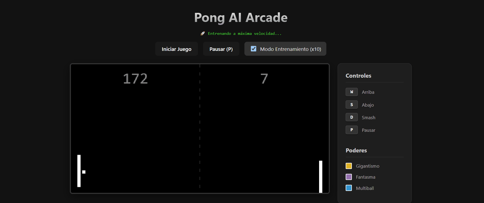

# Neural Pong Evolution



Proyecto de Inteligencia Artificial que utiliza Aprendizaje por Refuerzo para dominar el clasico juego de Pong mediante una arquitectura cliente-servidor hibrida.

## Instalacion y Requisitos

**1. Preparar el Frontend (Navegador):**
```bash
npm install
npm run dev
```

**2. Preparar el Backend (Python):**
Abre una nueva terminal y ejecuta:
```bash
cd backend
python -m venv venv
.\venv\Scripts\activate
pip install -r requirements.txt
```

## Guia de Uso Rapido

### 1. Entrenar a la Inteligencia Artificial
Si deseas que la maquina aprenda desde cero:
```bash
cd backend
.\venv\Scripts\activate
python train.py
```
*Abre el navegador en la URL que te de el frontend, marca la casilla **"Modo Entrenamiento (x10)"** y dale a Iniciar. La IA empezara a jugar contra el maestro a maxima velocidad.*

### 2. Jugar contra la IA (Inferencia)
Si ya tienes modelos entrenados y quieres retarlos:
```bash
cd backend
.\venv\Scripts\activate
python play.py
```
*Abre el navegador, **asegurate de desmarcar** la casilla de entrenamiento y dale a Iniciar. Usa las teclas `W` (Arriba), `S` (Abajo) y `D` (Aceleracion/Smash) para intentar ganarle a tu creacion.*

### 3. Cambiar de Modelo / Dificultad
Mientras entrenas, el sistema guarda automaticamente copias de seguridad de la IA en varios niveles (ej. `pong_nivel_20000_steps.zip`). 
Para pelear contra un nivel mas facil, simplemente abre el archivo `backend/play.py` y cambia la ruta del archivo en la linea correspondiente:
```python
MODEL_PATH = "models/pong_nivel_20000_steps.zip"
```

---

## Tecnologias Principales
- **Motor Grafico (Frontend):** TypeScript, HTML5 Canvas, Vite.
- **Servidor de Inferencia (Backend):** Python, FastAPI, WebSockets.
- **Inteligencia Artificial:** Gymnasium, Stable-Baselines3 (Proximal Policy Optimization).

Para obtener documentacion tecnica a nivel experto, explicacion de los algoritmos, reglas del entorno, y el por que de la configuracion asincrona, consulte el [**Manual Tecnico (manual.md)**](./manual.md).
